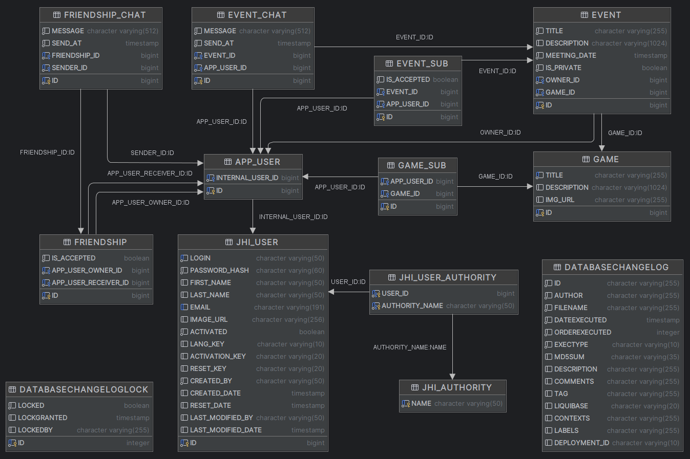

# Gamer Squad

 


> [!CAUTION]
> This project is developed as part of Java developer training course provided by [OpenClassrooms](https://openclassrooms.com).
> Its goal is to apply skills learned in previous projects.
> As such, the application has only an educational purpose and the information it may contain is not guaranteed.

## 📄 Presentation

### Goal

Sometimes it is complicated as a player to find new companions.
game or get together with friends for a session.

The goal here is to respond to this problem that I set myself the objective of creating a
web application with which users will have the opportunity to meet,
to exchange and organize around their favorite games.

### Description

This web application will allow registered users to define the games to which
they want to play with several people in order to meet other players with the same
hobbies. They will be able to make friend requests and message them
will allow them to communicate with each other.

Users will also have the ability to create events defined in the
time on a particular game. This event will represent a gaming session that
can be private or public. The user will then be able to invite their friends and
members interested in this game. If the event is public all users who have
as a center of interest this game in particular will see it and will be able to register. THE
Members registered for this event will have access to group messaging.

### Features

- **Registration**: Classic with email validation.
- **Game**: A user will be able to subscribe to a game and will appear in the list players of this game.
- **Friend**: A user can make a friend request from the list of players for a game. The other person can accept or refuse.
- **Event**: A user can create an event (private or public) to a specific game on a specific date and time. Invite his friends to this
  event. If the event is public users who have tagged this game will be able to join the event that will appear in the event list of this game.
- **Messaging**: A chat between 2 friendly users will be available. And a chat per event available for subscribed players.

> [!NOTE]
> This application was generated using JHipster 7.9.4, you can find documentation and help at [JHipster](https://www.jhipster.tech/documentation-archive/v7.9.4).

---

## 🔧 Settings

### Mail :

Mailing feature inside the application is set up to use gmail server to change see : [Configuring Email](https://www.jhipster.tech/documentation-archive/v7.9.4/tips/011_tip_configuring_email_in_jhipster.html)

You have to create 2 environments variables to access smtp server :

- `GAMERSQUAD_MAIL_USERNAME` = _myMailUsername_
- `GAMERSQUAD_MAIL_PASSWORD` = _myMailPassword_

---

## 💾 Database



### LiquidBase

The application use **Liquibase** to create the database : `H2` for dev profile or `Postgres` for prod profile.

### Fake Data

And populate the database with data from `.csv` files. You can find these files inside `data` & `fake-data` directories from `src/main/resources/config/liquibase`

> An important note is that the data from files inside these directories is used during integration testing so be careful if you modify these files.

So we have some data to play with when we launch the application with the command : `./mvnw`

The useful data to know are the user identifiers to be able to connect to their account :

| Login   | Password | Authorities  |
| :------ | :------- | :----------: |
| admin   | admin    | ADMIN + USER |
| user    | user     |     USER     |
| anne    | anne     |     USER     |
| bruno   | bruno    |     USER     |
| charles | charles  |     USER     |
| daniel  | daniel   |     USER     |
| elisa   | elisa    |     USER     |
| fred    | fred     |     USER     |
| gaspard | gaspard  |     USER     |
| helene  | helene   |     USER     |
| ivan    | ivan     |     USER     |
| jeanne  | jeanne   |     USER     |

---

## 📁 Project Structure

Node is required for generation and recommended for development. `package.json` is always generated for a better development experience with prettier, commit hooks, scripts and so on.

In the project root, JHipster generates configuration files for tools like git, prettier, eslint, husky, and others that are well known, and you can find references in the web.

### General :

- `/src/*` structure follows default `Maven` structure.
- `/src/main/java/*` structure follows default `Java` structure, it is the **back-end**.
- `/src/main/webapp/*` structure follows default `Angular` structure, it is the **front-end**.

### Other :

- `.yo-rc.json` - Yeoman configuration file
  JHipster configuration is stored in this file at `generator-jhipster` key. You may find `generator-jhipster-*` for specific blueprints configuration.
- `.yo-resolve` (optional) - Yeoman conflict resolver
  Allows to use a specific action when conflicts are found skipping prompts for files that matches a pattern. Each line should match `[pattern] [action]` with pattern been a [Minimatch](https://github.com/isaacs/minimatch#minimatch) pattern and action been one of skip (default if omitted) or force. Lines starting with `#` are considered comments and are ignored.
- `.jhipster/*.json` - JHipster entity configuration files

- `npmw` - wrapper to use locally installed npm.
  JHipster installs Node and npm locally using the build tool by default. This wrapper makes sure npm is installed locally and uses it avoiding some differences different versions can cause. By using `./npmw` instead of the traditional `npm` you can configure a Node-less environment to develop or test your application.
- `/src/main/docker` - Docker configurations for the application and services that the application depends on

---

## 💻 Development

Before you can build this project, you must install and configure the following dependencies on your machine:

1. [Node.js][]: We use Node to run a development web server and build the project.
   Depending on your system, you can install Node either from source or as a pre-packaged bundle.

After installing Node, you should be able to run the following command to install development tools.
You will only need to run this command when dependencies change in [package.json](package.json).

```
npm install
```

We use npm scripts and [Angular CLI][] with [Webpack][] as our build system.

Run the following commands in two separate terminals to create a blissful development experience where your browser
auto-refreshes when files change on your hard drive.

```
./mvnw
npm start
```

Npm is also used to manage CSS and JavaScript dependencies used in this application. You can upgrade dependencies by
specifying a newer version in [package.json](package.json). You can also run `npm update` and `npm install` to manage dependencies.
Add the `help` flag on any command to see how you can use it. For example, `npm help update`.

The `npm run` command will list all the scripts available to run for this project.

### PWA Support

JHipster ships with PWA (Progressive Web App) support, and it's turned off by default. One of the main components of a PWA is a service worker.

The service worker initialization code is disabled by default. To enable it, uncomment the following code in `src/main/webapp/app/app.module.ts`:

```typescript
ServiceWorkerModule.register('ngsw-worker.js', { enabled: false });
```

### Managing dependencies

For example, to add [Leaflet][] library as a runtime dependency of your application, you would run following command:

```
npm install --save --save-exact leaflet
```

To benefit from TypeScript type definitions from [DefinitelyTyped][] repository in development, you would run following command:

```
npm install --save-dev --save-exact @types/leaflet
```

Then you would import the JS and CSS files specified in library's installation instructions so that [Webpack][] knows about them:
Edit [src/main/webapp/app/app.module.ts](src/main/webapp/app/app.module.ts) file:

```
import 'leaflet/dist/leaflet.js';
```

Edit [src/main/webapp/content/scss/vendor.scss](src/main/webapp/content/scss/vendor.scss) file:

```
@import '~leaflet/dist/leaflet.css';
```

Note: There are still a few other things remaining to do for Leaflet that we won't detail here.

For further instructions on how to develop with JHipster, have a look at [Using JHipster in development][].

### Using Angular CLI

You can also use [Angular CLI][] to generate some custom client code.

For example, the following command:

```
ng generate component my-component
```

will generate few files:

```
create src/main/webapp/app/my-component/my-component.component.html
create src/main/webapp/app/my-component/my-component.component.ts
update src/main/webapp/app/app.module.ts
```

### JHipster Control Center

JHipster Control Center can help you manage and control your application(s). You can start a local control center server (accessible on http://localhost:7419) with:

```
docker-compose -f src/main/docker/jhipster-control-center.yml up
```

---

## 📦 Building for production

### Packaging as jar

To build the final jar and optimize the GamerSquad application for production, run:

```
./mvnw -Pprod clean verify
```

This will concatenate and minify the client CSS and JavaScript files. It will also modify `index.html` so it references these new files.
To ensure everything worked, run:

```
java -jar target/*.jar
```

Then navigate to [http://localhost:8080](http://localhost:8080) in your browser.

Refer to [Using JHipster in production][] for more details.

### Packaging as war

To package your application as a war in order to deploy it to an application server, run:

```
./mvnw -Pprod,war clean verify
```

---

## ✅ Testing

To launch your application's tests, run:

```
./mvnw verify
```

### Client tests

Unit tests are run by [Jest][]. They're located in [src/test/javascript/](src/test/javascript) and can be run with:

```
npm test
```

UI end-to-end tests are powered by [Cypress][]. They're located in [src/test/javascript/cypress](src/test/javascript/cypress)
and can be run by starting Spring Boot in one terminal (`./mvnw spring-boot:run`) and running the tests (`npm run e2e`) in a second one.

#### Lighthouse audits

You can execute automated [lighthouse audits][https://developers.google.com/web/tools/lighthouse/] with [cypress audits][https://github.com/mfrachet/cypress-audit] by running `npm run e2e:cypress:audits`.
You should only run the audits when your application is packaged with the production profile.
The lighthouse report is created in `target/cypress/lhreport.html`

For more information, refer to the [Running tests page][].

### Code quality

Sonar is used to analyse code quality. You can start a local Sonar server (accessible on http://localhost:9001) with:

```
docker-compose -f src/main/docker/sonar.yml up -d
```

Note: we have turned off authentication in [src/main/docker/sonar.yml](src/main/docker/sonar.yml) for out of the box experience while trying out SonarQube, for real use cases turn it back on.

You can run a Sonar analysis with using the [sonar-scanner](https://docs.sonarqube.org/display/SCAN/Analyzing+with+SonarQube+Scanner) or by using the maven plugin.

Then, run a Sonar analysis:

```
./mvnw -Pprod clean verify sonar:sonar
```

If you need to re-run the Sonar phase, please be sure to specify at least the `initialize` phase since Sonar properties are loaded from the sonar-project.properties file.

```
./mvnw initialize sonar:sonar
```

For more information, refer to the [Code quality page][].

---

## 🐳 Using Docker to simplify development (optional)

You can use Docker to improve your JHipster development experience. A number of docker-compose configuration are available in the [src/main/docker](src/main/docker) folder to launch required third party services.

For example, to start a postgresql database in a docker container, run:

```
docker-compose -f src/main/docker/postgresql.yml up -d
```

To stop it and remove the container, run:

```
docker-compose -f src/main/docker/postgresql.yml down
```

You can also fully dockerized your application and all the services that it depends on.
To achieve this, first build a docker image of your app by running:

```
npm run java:docker
```

Or build an arm64 docker image when using an arm64 processor os like macOS with M1 processor family running:

```
npm run java:docker:arm64
```

Then run:

```
docker-compose -f src/main/docker/app.yml up -d
```

When running Docker Desktop on macOS Big Sur or later, consider enabling experimental `Use the new Virtualization framework` for better processing performance ([disk access performance is worse](https://github.com/docker/roadmap/issues/7)).

For more information refer to [Using Docker and Docker-Compose][], this page also contains information on the docker-compose sub-generator (`jhipster docker-compose`), which is able to generate docker configurations for one or several JHipster applications.

---

## 💚 Continuous Integration (optional)

To configure CI for your project, run the ci-cd sub-generator (`jhipster ci-cd`), this will let you generate configuration files for a number of Continuous Integration systems. Consult the [Setting up Continuous Integration][] page for more information.

[jhipster homepage and latest documentation]: https://www.jhipster.tech
[jhipster 7.9.4 archive]: https://www.jhipster.tech/documentation-archive/v7.9.4
[using jhipster in development]: https://www.jhipster.tech/documentation-archive/v7.9.4/development/
[using docker and docker-compose]: https://www.jhipster.tech/documentation-archive/v7.9.4/docker-compose
[using jhipster in production]: https://www.jhipster.tech/documentation-archive/v7.9.4/production/
[running tests page]: https://www.jhipster.tech/documentation-archive/v7.9.4/running-tests/
[code quality page]: https://www.jhipster.tech/documentation-archive/v7.9.4/code-quality/
[setting up continuous integration]: https://www.jhipster.tech/documentation-archive/v7.9.4/setting-up-ci/
[node.js]: https://nodejs.org/
[npm]: https://www.npmjs.com/
[webpack]: https://webpack.github.io/
[browsersync]: https://www.browsersync.io/
[jest]: https://facebook.github.io/jest/
[cypress]: https://www.cypress.io/
[leaflet]: https://leafletjs.com/
[definitelytyped]: https://definitelytyped.org/
[angular cli]: https://cli.angular.io/
